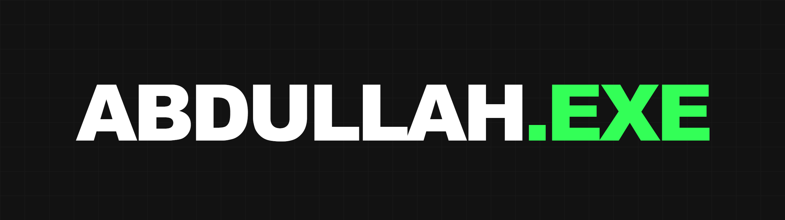

<p align="center">
  
</p>

<p align="center">
  <b>Full Stack Developer</b> &nbsp;·&nbsp; Web &nbsp;·&nbsp; Mobile &nbsp;·&nbsp; AI &amp; Data &nbsp;·&nbsp; Hardware
  <br>
  <a href="https://abdullahexe.online">abdullahexe.online</a> &nbsp;|&nbsp;
  <a href="https://www.linkedin.com/in/abzoola">LinkedIn</a> &nbsp;|&nbsp;
  <a href="https://github.com/4bdulllahh">GitHub</a> &nbsp;|&nbsp;
  <a href="mailto:abdullahworkaholic@gmail.com">abdullahworkaholic@gmail.com</a>
</p>

---

## About me

I'm **Abdullah Kamran**, a full stack developer who started on a sales floor rather than in a lecture hall.

In 2022 I was selling B2B uniform contracts at Uniformers and kept running into the same wall: a good pitch undone by a bad website. So I taught myself HTML, CSS and JavaScript between sales calls and rebuilt it. I haven't stopped building since. A BSc in Computer Science at **Bath Spa University** gave that instinct a backbone. Now I take projects end to end: the design, the backend, the deploy, and the client conversation in between.

I learn a technology because something in front of me is broken and that's what fixes it, not because it's trending. That's how I ended up building cold-email infrastructure, a face-tracking laser turret, a stroke-prediction model and a Unity game, all in the same few years.

## What I can do

- **Build full-stack web products end to end.** Storefronts with real payment walls, CRMs with analytics dashboards, and marketing sites that make a business look as good as it is.
- **Ship desktop tools that solve business problems.** [HomingPigeon](https://github.com/4bdulllahh/HomingPigeon) keeps cold outreach out of spam folders with SPF/DKIM/DMARC checks, warm-up ramping and spam scoring. [LeadsVeri](https://github.com/4bdulllahh/Auto-Leads-Checker-) verifies lead lists before a sales team wastes a day on them.
- **Build native Android apps** in Kotlin and Java, including apps that consume live REST APIs.
- **Work with data and AI.** Machine learning models in scikit-learn, AI agents with Google's Agent Development Kit, and AI assistants embedded in client sites.
- **Connect software to hardware.** Real-time computer vision driving Arduino-controlled servos.
- **Design the interface too.** Every site I ship is designed by me, including this one.

## Skills

| Area | Stack |
|---|---|
| **Frontend** | HTML5 · CSS3 · JavaScript · React · Next.js · Vue 3 · Tailwind CSS · Three.js · GSAP |
| **Backend & Data** | Python · Node.js · Express · REST APIs · MongoDB · MySQL · SQLite · SQL |
| **AI & Data** | Pandas · Scikit-learn · Google Agent Development Kit · LLM prompting · OpenCV · Kaggle |
| **Mobile** | Kotlin · Java · Android SDK · Android Studio · Gradle · Material UI |
| **Desktop & Hardware** | PyQt6 · asyncio · PyInstaller · C++ · Arduino · 3D printing |
| **Games** | Unity · C# · Twine / Harlowe |
| **Design & Tooling** | Figma · Adobe Creative Suite · Git · GitHub · Vite · Vercel |

The full breakdown, with the project each skill was used on, is at [abdullahexe.online/skills.html](https://abdullahexe.online/skills.html).

## Featured work

| Project | What it is |
|---|---|
| [**HomingPigeon**](https://github.com/4bdulllahh/HomingPigeon) | Desktop app for safe, compliant business cold email. Python, PyQt6, SQLite |
| [**Hannah Morgan Homes**](https://morgan-horizon-homes.base44.app/) | Luxury real estate site with an AI buyer assistant, CRM and analytics. Vue 3, Vite, Tailwind |
| [**Dekor**](https://dekorfurniture.vercel.app/) | Furniture storefront with a product database and payment wall. Node.js, Express, MongoDB, Three.js |
| [**Face-Tracking Laser**](https://github.com/4bdulllahh/Face-Tracking-Laser) | 3D-printed servo turret driven by real-time face detection. Python, OpenCV, Arduino |
| [**LeadsVeri**](https://github.com/4bdulllahh/Auto-Leads-Checker-) | Desktop lead-list verifier for cold outreach teams. Python, asyncio |
| [**Stroke Prediction**](https://www.kaggle.com/code/abood186/stroke-prediction-using-randomforestclassifier) | RandomForest classifier on clinical data. Python, pandas, scikit-learn |

All thirteen projects are at [abdullahexe.online/work.html](https://abdullahexe.online/work.html).

## About this repo

This is the source for my portfolio at [abdullahexe.online](https://abdullahexe.online): a hand-built, neo-brutalist static site with no framework and no build step.

```
Abdullah.exe/
├── index.html      landing page
├── about.html      bio, beliefs, how I work
├── skills.html     full technical breakdown
├── logs.html       work history, education, achievements
├── work.html       all projects, filterable
├── css/style.css   shared styles, boot sequence, page transitions
├── js/main.js      cursor, reveal, transitions, certificate carousel
└── Assets/         images, certificates, resume
```

To run it locally:

```bash
cd Abdullah.exe
python -m http.server 8000
# open http://localhost:8000
```

## Contact

I'm available for full-time roles and freelance projects.

📧 **[abdullahworkaholic@gmail.com](mailto:abdullahworkaholic@gmail.com)**
